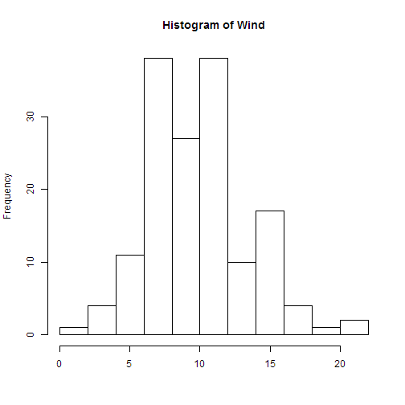

An Introduction to the Ozone Prediction ShinyApp
==================================
author: Wang Jun
date: Aug 24th, 2014

Basic Idea
========================================================

To analyze the main factors of impact to the desity of **Ozone**, we load the default dataset of airquality in R. Among various factors, we focus on 3 variables:

- Solar radiation 
- Wind 
- Temperature 

Summary of Airquality Dataset
========================================================


```
     Ozone          Solar.R         Wind            Temp     
 Min.   :  1.0   Min.   :  7   Min.   : 1.70   Min.   :56.0  
 1st Qu.: 18.0   1st Qu.:116   1st Qu.: 7.40   1st Qu.:72.0  
 Median : 31.5   Median :205   Median : 9.70   Median :79.0  
 Mean   : 42.1   Mean   :186   Mean   : 9.96   Mean   :77.9  
 3rd Qu.: 63.2   3rd Qu.:259   3rd Qu.:11.50   3rd Qu.:85.0  
 Max.   :168.0   Max.   :334   Max.   :20.70   Max.   :97.0  
 NA's   :37      NA's   :7                                   
     Month           Day      
 Min.   :5.00   Min.   : 1.0  
 1st Qu.:6.00   1st Qu.: 8.0  
 Median :7.00   Median :16.0  
 Mean   :6.99   Mean   :15.8  
 3rd Qu.:8.00   3rd Qu.:23.0  
 Max.   :9.00   Max.   :31.0  
                              
```

Histogram of factors
========================================================
In order to show the distribution of these 3 factors, we give a demostration of histograms.
 

Linear Regression Model
========================================================
We can use these 3 facotrs to build a linear regression model to predict the density of Ozone in the air.

```

Call:
lm(formula = Ozone ~ Solar.R + Wind + Temp, data = airquality)

Residuals:
   Min     1Q Median     3Q    Max 
-40.48 -14.22  -3.55  10.10  95.62 

Coefficients:
            Estimate Std. Error t value Pr(>|t|)    
(Intercept) -64.3421    23.0547   -2.79   0.0062 ** 
Solar.R       0.0598     0.0232    2.58   0.0112 *  
Wind         -3.3336     0.6544   -5.09  1.5e-06 ***
Temp          1.6521     0.2535    6.52  2.4e-09 ***
---
Signif. codes:  0 '***' 0.001 '**' 0.01 '*' 0.05 '.' 0.1 ' ' 1

Residual standard error: 21.2 on 107 degrees of freedom
  (42 observations deleted due to missingness)
Multiple R-squared:  0.606,	Adjusted R-squared:  0.595 
F-statistic: 54.8 on 3 and 107 DF,  p-value: <2e-16
```
Explanation to the Model
========================================================
From the demostration model, we can clearly see these 3 variables are all have magnificent impacts on the density of Ozone.

You can select any of the 3 variables to include in the regression model to see the difference.
